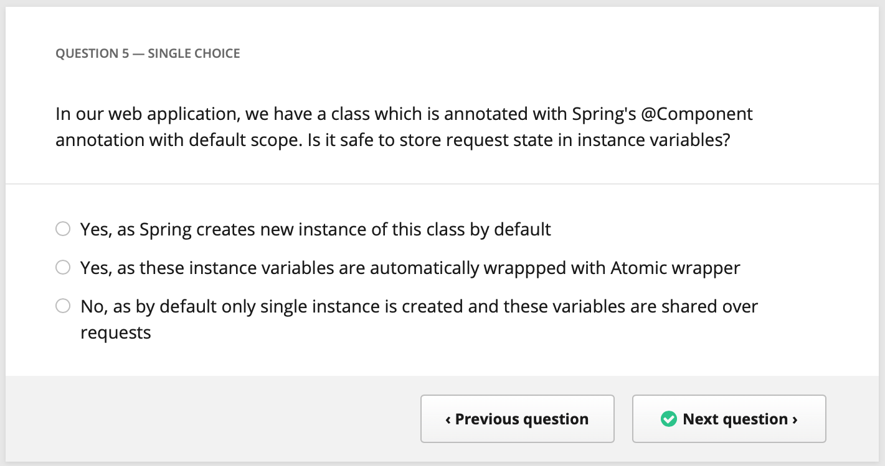
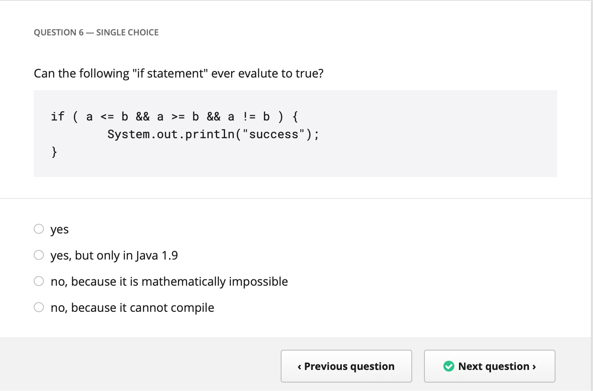
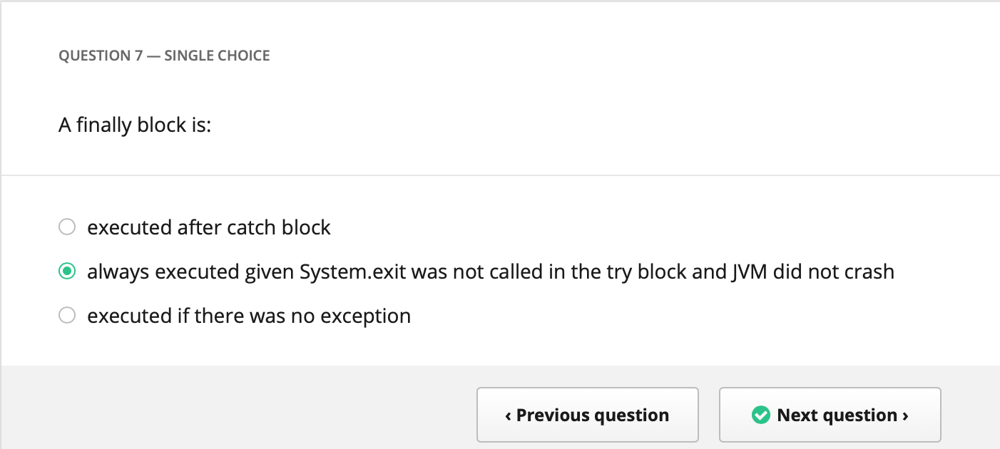
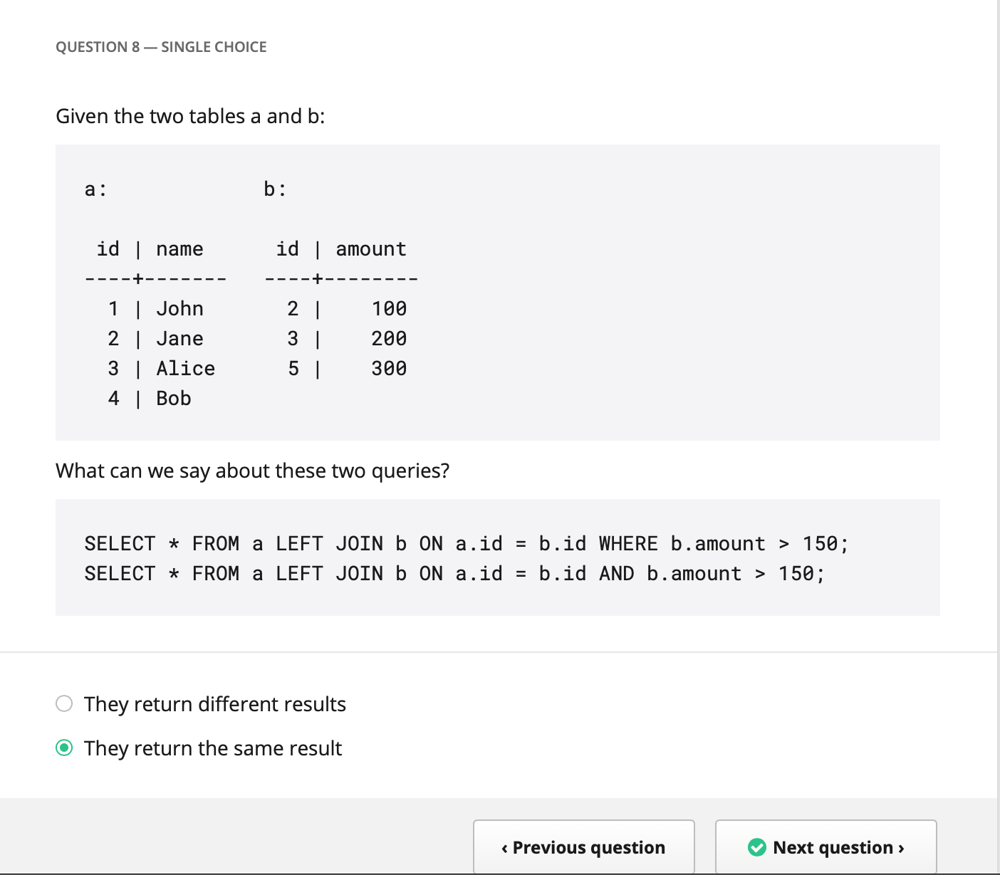

# Hundred 5
## Java Multiple Choice Questions

Company| Monese
---|---
Date|Jan. 2019
Platform|Hundred5

### Question 5
In our web application, we have a class which is annotated with Spring's @Component annotation with default scope. Is it safe to store request state in instance variables?

* Yes, as Spring creates new instances of this class by default
* Yes, as these instance variables are automatically wrapped with Atomic wrapper
* No, as by default only single instance is created and these variables are shared over requests (correct answer)



### Question 6
Can the following "if statement" ever evaluate to true?
```java
if ( a <= b && a >= b && a != b ) {
    System.out.println("success");
}
```

* yes (correct answer)
* yes, but only in Java 1.9
* no, because it is mathematically impossible 
* no, because it cannot compile



### Question 7
A finally block is:

* executed after catch block
* always executed given System.exit was not called in the try block and JVM did not crash (correct answer)
* executed if there was no exception



### Question 8
Given the two tables a and b:

```
a:              b:

 id | name       id | amoount
----+-----      ----+---------
  1 | John        2 | 100
  2 | Jane        3 | 200
  3 | Alice       4 | 300
  4 | Bob
```
What can we say about these two queries?
```sql
SELECT * FROM a LEFT JOIN b ON a.id = b.id WHERE b.amount > 150;
SELECT * FROM a LEFT JOIN b ON a.id = b.id AND b.amount > 150;
```

* They return different results (correct answer)
* They return the same result 



