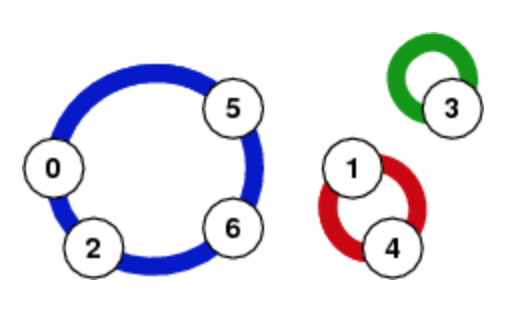

# Longest Necklace

Company|TopTal
---|---
Date| 10/12/2018
Platform| Codility

You have a lot of beads. Each bead has a number from 0 to N-1. You want to build a necklace. An array A is given containing for bead i the next bead in the necklace. 

For example, given A such that:

```
A[0] = 5
A[1] = 4
A[2] = 0
A[3] = 3
A[4] = 1
A[5] = 6
A[6] = 2
``` 

the function should return 4, because the longest necklase is the one containing four beads: numbers {0,5,6,2}. Presented below are the untangeled necklaces.



Write and **efficient** algorithm for the following assumptions:

* N is an integer within the range [0..1,000,000,000];
* the elements of A are all between 0 and N-1

