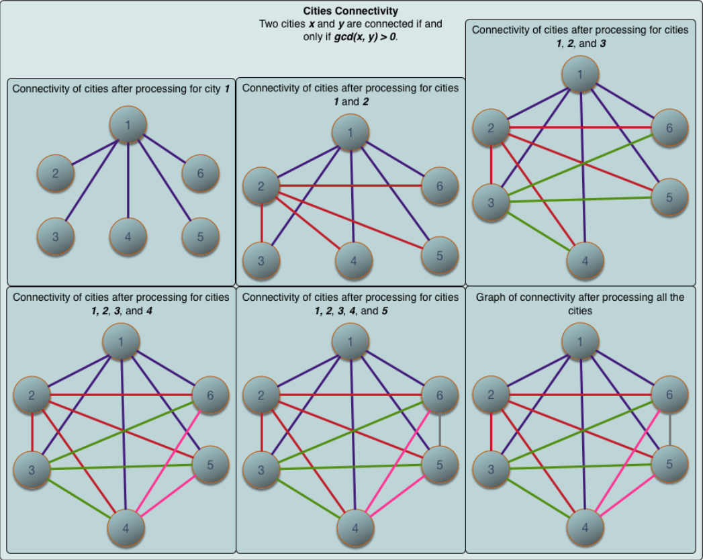
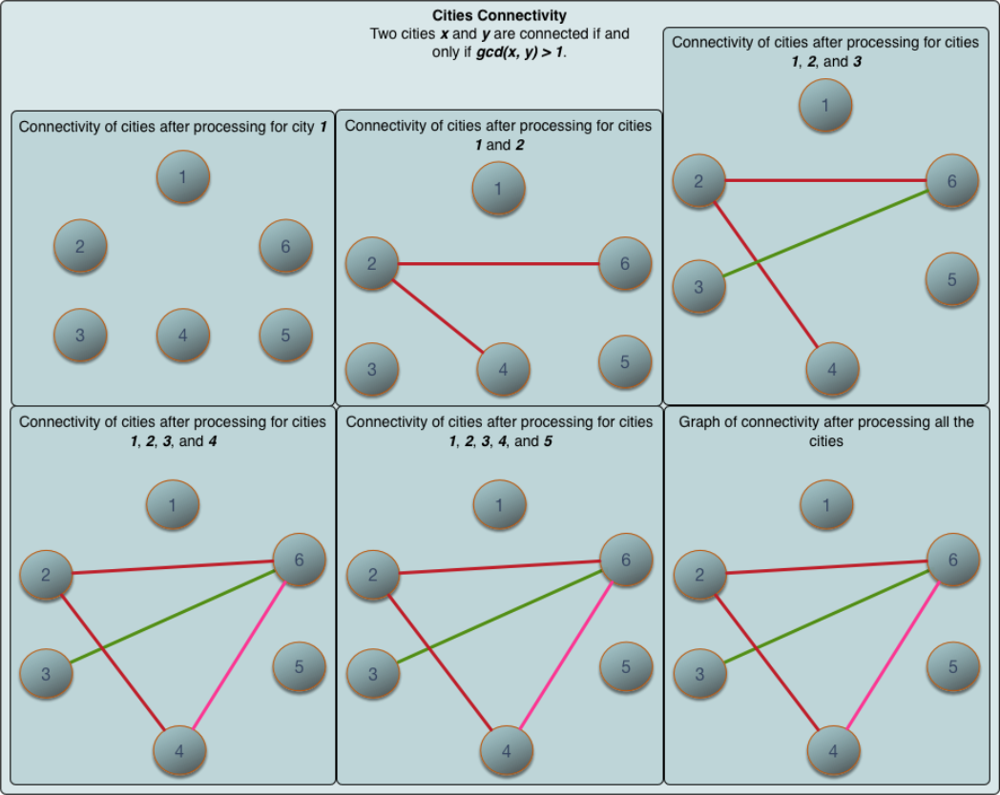

# Traveling is Fun

Company| Ascend.io
---|---
Date|Nov. 2018
Platform|HackerRank

Julia is planning a vacatioin and has a list of cities she wants to visit. She doesn't have a map of the area, but she does have some data that will help here determine whether there is a road connection all the cities she wants to visit. The data comes in the form of two arrays. Each of the first array's elements is an origin city. Each of the second array's is a destination. Tehre is also an integer value threshold. The can tell that any two cities are connected if the values at origin and destination share a common divisor greater than the threshold. Citites are indexed starting at _0_.

Each of the pairs, _originCities[0]_ and _destinationCities[0]_ for example, represents a route she wants to take. For each pair, determine whether there is a route between cities. The route does not have to be direct. See the explanation to Sample Case 1 relating to originCity equals _2_ or _4_ for examples.

For instance, consider an array _originCities = [1,2,3]_ and _destinationCities = [4,5,6]_. The threshold value is _2_. There are 6 total cities. To draw the map, first determine the divisors of all cities:

Origin Cities|Divisors| Destination Cities|Divisors
----|----|-----|----
1|1|4|1,2,4
2|1,2|5|1,5
3|1,3|6|1,2,3,6

The threshold is _2_, so we can eliminate cities _1_ and _2_. Their deivisors are not greater than the threshold. This leaves city _3_ to check in the origins list. It has a divisor in common with city _6_, and is greater than the threshold so there is a road between them. This is the only pair connected cities. Now that we have created a map, we can check her routes.

She wants to go from _originCity[0] = 1_ to _desitinationCity[0] = 4_ but there is no road. There is no road for her second route either, form city _2_ to _5_. There is only a road that matches her third route at index 2, from city _3_ to _6_. A true/fals array of her results would be _paths = [0,0,1]_.

### Function description
Complete the function _connected Cities_ in the editor below. The function must return a true/fals array where each _paths[i]_ contains _1_ if the route between _originCities[i]_ and _destinationCities[i]_ exists, or _0_ if it does not.

connectedCities has the following parameter(s):
    _n_: integer, the number of cities
    _g_: integer, the threshold value
    _originCities[originCities[0], ... originCities[q-1]]_: an array of integers
    _desitinationCities[desitnationCities[0], ... desitinationCities[q-1]]_: an array of integers

### Constraints
* 2 <= n <= 2 *10^5
* 0 <= g <= n
* 1 <= q <= min(n*(n-1)/2, 10^5)
* 1 <= originCities[i], destinationCities[i] <= n, where 0 <= i < q 
* originCities[i] != destinationCities[i], where 0 <= i < q 

### Input Format for Custom Testing
Input from stdin will be processed as follows and passed to the function.

The first line contains an integer _n_, the total number of cities.
The second line contains an integer _g_, the threshold value.
The next line contains an integer _q_ the size of the array _originCities_.
The next _q_ lines each contain an element _originCities[i]_ where 0 <= i < q.
The next line contains an integer _q_, the size of the array _destinationCities_.
The next _q_ lines each contain an element _destinationCities[i]_ where 0 <= i < q.

### Sample Case 0
#### Sample Input 0
```
6
0
4
1
4
3
6
4
3
6
2
5
```
#### Sample Output 0
```
1
1
1
1
```
#### Explanation 0
There are _n = 6_ cities and _g = 0_. We know that two cities _x_ and _y_ are connected if and only if the greatest common divisor, _gcd(x,y)>0_. A map is drawn below.



The city graph. Each city is directly connected to other cities, so a path always exists for each _(x,y)_ pair.

Julia wants to know whether any path exists from:
* City _1_ to city _3_
* City _4_ to city _6_
* City _3_ to city _2_
* City _6_ to city _5_

Let the return array be _paths_, then:
* _paths[0] = 1_ because a path exists from city _1_ to city _3_.
* _paths[1] = 1_ because a path exists from city _4_ to city _6_. 
* _paths[2] = 1_ because a path exists from city _3_ to city _2_. 
* _paths[3] = 1_ because a path exists from city _6_ to city _5_.

Return _paths = [1,1,1,1]_ as the answer.

### Sample Case 1
#### Sample Input 1
```
6
1
4
1
2
4
6
4
3
3
3
4
```
#### Sample Output 1
```
0
1
1
1
```
#### Explanation 1
There are _n = 6_ cities and _g = 1_. We know that two cities _x_ and _y_ are connected if and only if the greatest common divisor, _gcd(x,y)>1_. A map is drawn below.



The city graph. 

Julia wants to know whether any path exists from:
* City _1_ to city _3_
* City _2_ to city _3_
* City _4_ to city _3_
* City _6_ to city _4_

Let the return array be _paths_, then:
* _paths[0] = 0_ because it's impossible to reach any city from city _1_.
* _paths[1] = 1_ because a path exists from city _2_ to city _3_. 
* _paths[2] = 1_ because a path exists from city _4_ to city _3_. 
* _paths[3] = 1_ because a path exists from city _6_ to city _4_.

Return _paths = [0,1,1,1]_ as the answer.

### Solution

This is my second solution. The first one using a dijkstra for each pair was corret but too slow. Afterwards I noticed that dijkstra is too much. A simple bfs or dfs search is enough. If you then add all combinations of nodes form one bfs search to the connectedness_matrix, the performance might be ok.

I didn't find the questions on HackerRank or LeetCode to validate my solution

```python
from collections import defaultdict
def connectedCities(n, g, originCities, destinationCities):
    # create a connectedness matrix
    connectedness_matrix = [[0 for i in range(n+1)] for i in range(n+1)]
    visited_nodes = defaultdict(bool)
    for i in range(len(originCities)):
        for j in range(len(destinationCities)):
            if gcd(originCities[i], destinationCities[j]) > g:    
                connectedness_matrix[originCities[i]][destinationCities[j]] = 1
                connectedness_matrix[destinationCities[j]][originCities[i]] = 1

    def bfs(a,b):
        result = []
        queue=[]
        queue.append(a)
        while queue:
            node = queue.pop(0)
            result.append(node)
            if not visited_nodes[node]:
                visited_nodes[node] = True
                for i in range(n+1):
                    if connectedness_matrix[node][i] == 1 and not visited_nodes[i]:
                        queue.append(i)

            if node == b:
                result.append(b)
                return result
        return result

    def bfs_cache(a,b):
        if connectedness_matrix[a][b] == 1:
            return 1
        if visited_nodes[a] and visited_nodes[b]:
            return 0
        connected_nodes = bfs(a,b)
        for i in range(len(connected_nodes)):
            for j in range(len(connected_nodes)):
                connectedness_matrix[connected_nodes[i]][connected_nodes[j]] = 1
                connectedness_matrix[connected_nodes[j]][connected_nodes[i]] = 1
        return connectedness_matrix[a][b]


    result_list = []
    for i in range(len(originCities)):
        result = bfs_cache(originCities[i], destinationCities[i])
        result_list.append(result)

    return result_list    

def gcd(a,b):
  while b!=0:
    r = a % b
    a = b
    b = r
  return a
  ```

